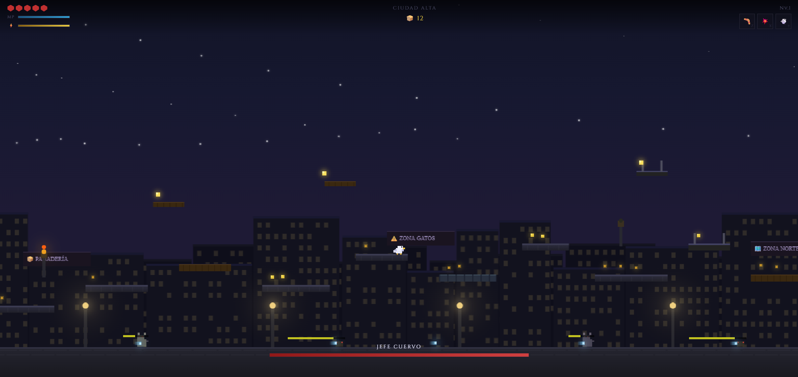

<div align="center">

<br/>

```
██████╗  █████╗ ██╗      ██████╗ ███╗   ███╗ █████╗
██╔══██╗██╔══██╗██║     ██╔═══██╗████╗ ████║██╔══██╗
██████╔╝███████║██║     ██║   ██║██╔████╔██║███████║
██╔═══╝ ██╔══██║██║     ██║   ██║██║╚██╔╝██║██╔══██║
██║     ██║  ██║███████╗╚██████╔╝██║ ╚═╝ ██║██║  ██║
╚═╝     ╚═╝  ╚═╝╚══════╝ ╚═════╝ ╚═╝     ╚═╝╚═╝  ╚═╝

███╗   ███╗██╗ ██████╗  █████╗      ██╗███████╗██████╗  █████╗
████╗ ████║██║██╔════╝ ██╔══██╗     ██║██╔════╝██╔══██╗██╔══██╗
██╔████╔██║██║██║  ███╗███████║     ██║█████╗  ██████╔╝███████║
██║╚██╔╝██║██║██║   ██║██╔══██║██   ██║██╔══╝  ██╔══██╗██╔══██║
██║ ╚═╝ ██║██║╚██████╔╝██║  ██║╚█████╔╝███████╗██║  ██║██║  ██║
╚═╝     ╚═╝╚═╝ ╚═════╝ ╚═╝  ╚═╝ ╚════╝ ╚══════╝╚═╝  ╚═╝╚═╝  ╚═╝
```

**Un juego de plataformas 2D de código abierto inspirado en Hollow Knight.**  
*Vuela por los tejados, recoge migajas y enfrenta a los guardianes de la ciudad nocturna.*

<br/>

[](LICENSE)
[]()
[]()
[](CONTRIBUTING.md)
[]()

<br/>


> *⚠️ Captura de referencia — la comunidad puede contribuir screenshots reales*

</div>

---

## 🕊️ ¿Qué es Paloma Migajera?

**Paloma Migajera** es un juego de plataformas y aventura 2D de código abierto, construido completamente en **HTML, CSS y JavaScript puro**, sin frameworks ni dependencias externas. Juegas como una paloma urbana que explora una ciudad nocturna en busca de migajas, enfrentando gatos, ratas y cuervos en una aventura de tipo metroidvania.

El proyecto nació como un desarrollo estudiantil y ahora **crece gracias a la comunidad**: cualquier persona puede contribuir con código, arte, música, niveles o traducciones.

> *"El primer salto es instinto; el segundo es voluntad."*

---

## ✨ Características actuales (v3.0.0)

### 🎮 Gameplay
- Motor de plataformas 2D con física y colisiones **pixel-perfectas** por lectura de mapa de bits
- Sistema de mapa **dual**: capa visual artística + capa de colisiones independiente
- 4 habilidades de movimiento desbloqueables: Doble Salto, Dash, Picado Balístico, Planeo Silencioso
- 3 habilidades activas: Ataque cuerpo a cuerpo, PALOMADUKEN, Arpegio de Choque
- Sistema de jefe con barra de HP dedicada
- Múltiples zonas conectadas por portales (Ciudad Alta, Alcantarillas, más por venir)
- Checkpoints con antorchas activables

### 🗺️ Mundo
- Mapa del mundo interactivo con progreso por zona
- Sistema de zonas con detalles de enemigos, jefes y recompensas
- Fondo de paralaje procedural con edificios, farolas y ventanas
- Arte generado programáticamente (listo para reemplazar con sprites reales)

### 🧩 Sistemas
- **4 niveles de dificultad**: Fácil, Normal, Difícil, Pesadilla
- **Sistema de save** completo con checkpoint, migajas, habilidades y tiempo jugado
- **Inventario** con consumibles, llaves, tesoros e ingredientes
- **Sistema de amuletos** equipables (hasta 3, estilo Hollow Knight)
- **Árbol de habilidades** con estado de desbloqueo por zona
- **Ajustes** completos: audio, gráficos, controles personalizables, idioma
- Auto-guardado configurable

### 🎨 UI / UX
- Diseño dark gothic con fuente Cinzel
- Partículas de migas flotantes ambientales
- HUD completamente separado del canvas del juego
- Pantallas dedicadas: Pausa, Muerte, Victoria, Diálogo NPC
- Transiciones suaves entre pantallas
- Sistema de toast de notificaciones

---

## 🚀 Cómo ejecutar el juego

No necesitas instalar nada. Solo abre el archivo en tu navegador:

```bash
# Clona el repositorio
git clone https://github.com/tu-usuario/paloma-migajera.git

# Entra al directorio
cd paloma-migajera

# Opción 1: Abre directamente en el navegador
open menu/index.html

# Opción 2: Usa un servidor local (recomendado para evitar restricciones CORS)
npx serve .
# o
python -m http.server 8080
# luego abre: http://localhost:8080/menu/index.html
```

> **Nota:** Recomendamos usar un servidor local para una experiencia completa. Los navegadores modernos (Chrome, Firefox, Edge) son compatibles. No se necesita Node.js, solo es opcional para el servidor.

---

## 📁 Estructura del proyecto

```
paloma-migajera/
│
├── 📁 shared/                  ← Recursos compartidos por todas las pantallas
│   ├── global.css              ← Sistema de diseño completo (variables, componentes)
│   └── utils.js                ← Save, config, navegación, partículas, toast
│
├── 📁 menu/
│   └── index.html              ← Menú principal (nueva partida, continuar, dificultad)
│
├── 📁 juego/                   ← Motor del juego
│   ├── index.html              ← Loop principal + HUD + pantallas de estado
│   ├── map-engine.js           ← Sistema dual visual/colisiones + definición de zonas
│   ├── entities.js             ← Jugador, enemigos, migajas, NPCs, portales, checkpoints
│   ├── physics.js              ← Física, combate, proyectiles, partículas, cooldowns
│   └── renderer.js             ← Dibujado pixel art: paloma, enemigos, migajas, efectos
│
├── 📁 mapa/
│   └── index.html              ← Mapa del mundo interactivo con progreso por zona
│
├── 📁 habilidades/
│   └── index.html              ← Árbol de habilidades + sistema de amuletos
│
├── 📁 inventario/
│   └── index.html              ← Inventario con grid, categorías y panel de detalle
│
├── 📁 ajustes/
│   └── index.html              ← Ajustes completos con sidebar (audio, gráficos, controles)
│
├── 📁 assets/                  ← ⭐ CARPETA PRINCIPAL DE CONTRIBUCIONES DE LA COMUNIDAD
│   ├── 📁 sprites/             ← Sprites de personajes y enemigos
│   ├── 📁 tilesets/            ← Tilesets para cada zona
│   ├── 📁 backgrounds/         ← Fondos artísticos por zona
│   ├── 📁 audio/               ← Música y efectos de sonido
│   │   ├── 📁 musica/
│   │   ├── 📁 sfx/
│   │   └── 📁 ambiente/
│   ├── 📁 ui/                  ← Elementos de interfaz
│   └── 📁 screenshots/         ← Capturas del juego para el README
│
├── 📁 docs/                    ← Documentación
│   ├── CONTRIBUTING.md         ← Guía de contribuciones
│   ├── ASSETS-GUIDE.md         ← Especificaciones técnicas de assets
│   ├── ZONES-DESIGN.md         ← Diseño de zonas y niveles
│   └── ROADMAP.md              ← Hoja de ruta del proyecto
│
├── README.md                   ← Este archivo
├── LICENSE                     ← Licencia MIT
└── .gitignore
```

---

## ⌨️ Controles

| Acción | Teclado por defecto |
|---|---|
| Mover | `←` `→` o `A` `D` |
| Saltar / Doble Salto | `ESPACIO` |
| Planeo (mantener) | `ESPACIO` en el aire |
| Picado | `↓` en el aire |
| Dash | `SHIFT` |
| Atacar | `Z` |
| PALOMADUKEN | `X` |
| Interactuar / NPC | `Z` cerca del personaje |
| Mapa | `M` |
| Inventario | `I` |
| Pausa | `ESC` |

> Todos los controles son **completamente personalizables** desde el menú de Ajustes.

---

## 🤝 Contribuir

¡Paloma Migajera es un proyecto comunitario y **toda contribución es bienvenida**! Aquí hay formas de participar:

### 🎨 Arte y Assets *(muy bienvenidos)*

El motor ya está listo para reemplazar el arte procedural con sprites y tilesets reales. Ver [`docs/ASSETS-GUIDE.md`](docs/ASSETS-GUIDE.md) para especificaciones técnicas detalladas.

**Lo que más se necesita ahora mismo:**
- Sprite sheet de la paloma (movimiento, ataque, dash, planeo)
- Tilesets para Ciudad Alta y Alcantarillas
- Sprites de enemigos: gato, rata, cuervo, jefe
- Música de fondo para cada zona (`.ogg` / `.mp3`)
- Efectos de sonido: salto, ataque, recoger migaja, daño
- Fondos artísticos con paralaje

**Cómo integrar assets:**
```javascript
// En map-engine.js, función buildVisual():
// Reemplaza ctx.fillRect(...) con:
const img = new Image();
img.src = '../assets/tilesets/ciudad-alta.png';
ctx.drawImage(img, x, y, w, h);

// Para la paloma, en renderer.js, función drawPlayer():
const sprite = new Image();
sprite.src = '../assets/sprites/paloma-sheet.png';
ctx.drawImage(sprite, frameX, frameY, 16, 16, rx, ry, player.w, player.h);
```

### 💻 Código

```bash
# Fork del repositorio
# Crea una rama descriptiva
git checkout -b feat/nombre-de-la-feature
# o
git checkout -b fix/descripcion-del-bug
# o
git checkout -b assets/nombre-del-asset

# Haz tus cambios
git commit -m "feat: descripción clara del cambio"

# Abre un Pull Request hacia main
```

**Áreas donde puedes contribuir:**
- Nuevas zonas del mundo (ver `entities.js` y `map-engine.js`)
- Nuevos tipos de enemigos
- Sistema de logros
- Soporte para gamepad / controles táctiles
- Traducciones (actualmente: Español, Inglés pendiente)
- Optimizaciones de rendimiento
- Tests y reporte de bugs

### 🐛 Reportar bugs

Abre un [Issue](../../issues) con:
1. Descripción del problema
2. Pasos para reproducirlo
3. Navegador y sistema operativo
4. Captura de pantalla si es posible

---

## 🗺️ Roadmap

### v3.1 — *Assets comunitarios*
- [ ] Integrar primer sprite sheet de la paloma
- [ ] Tileset para Ciudad Alta
- [ ] Efectos de sonido básicos (salto, migaja, daño)
- [ ] Sistema de logros con 20 logros

### v3.2 — *Contenido*
- [ ] Zona: Tejado de los Gansos
- [ ] Zona: Nido del Halcón
- [ ] Jefe: Rata Reina (Alcantarillas)
- [ ] Tienda NPC con migajas como moneda
- [ ] 5 NPCs con diálogos completos

### v3.3 — *Pulido*
- [ ] Música de fondo por zona
- [ ] Soporte gamepad (API Gamepad)
- [ ] Pantalla de logros
- [ ] Modo speedrun con cronómetro
- [ ] Traducción al inglés completa

### v4.0 — *Futuro*
- [ ] Editor de niveles visual
- [ ] Modo de 2 zonas adicionales
- [ ] Sistema de guardado en la nube (opcional)
- [ ] Versión móvil con controles táctiles

---

## 🔧 Guía técnica rápida

### Sistema de mapa dual (cómo funciona)

```javascript
// En map-engine.js, cada zona define DOS funciones de dibujado:

// 1. Visual: lo que el jugador VE (arte, texturas, colores)
function drawPlatformVisuals(ctx, W, H) {
  // Dibuja con gradientes, sombras, decoración...
  ctx.fillStyle = '#2e2e40';
  ctx.fillRect(x, y, w, h);
}

// 2. Colisiones: lo que el motor LEE (blanco = sólido, negro = vacío)
function drawPlatformCollisions(ctx, W, H) {
  ctx.fillStyle = '#ffffff';  // ← blanco puro = sólido
  ctx.fillRect(x, y, w, h);
}

// La física lee píxel a píxel:
function isSolid(colData, x, y) {
  const idx = (Math.floor(y) * MAP_W + Math.floor(x)) * 4;
  return colData.data[idx] > 128; // canal R > 128 → sólido
}
```

Para usar imágenes PNG reales como mapas de colisión, simplemente dibuja tu PNG en el canvas de colisiones antes de `getImageData()`. Los píxeles blancos en tu imagen serán suelo, los negros serán vacío.

### Agregar una nueva zona

```javascript
// En map-engine.js, agrega al objeto ZONES:
ZONES['mi_nueva_zona'] = function(v, c, W, H) {
  // v = canvas visual context
  // c = canvas colisión context
  drawMiArte(v, W, H);        // tu arte aquí
  c.fillStyle = '#fff';
  drawMisColisiones(c, W, H); // tus plataformas aquí
};

// En entities.js, agrega enemigos y migajas:
ZONE_ENEMIES['mi_nueva_zona'] = [ ... ];
ZONE_MIGAJAS['mi_nueva_zona'] = [ ... ];

// En el portal de la zona anterior:
ZONE_PORTALS['zona_anterior'] = [
  { x: 3150, y: 0, w: 40, h: 900, toZone: 'mi_nueva_zona', label: 'Mi Zona →' }
];
```

### Agregar un nuevo enemigo

```javascript
// En entities.js:
ENEMY_DEFS['perro'] = {
  w: 24, h: 18, hp: 5, speed: 1.4, dmg: 2,
  aggroRange: 200, atkRange: 30, atkCooldown: 800, stunDur: 300,
  xp: 25, migajas: 5, color: '#604020',
};

// En renderer.js, agrega un caso en drawEnemy():
} else if(e.type === 'perro') {
  drawDog(ctx, e, rx, ry);
}
```

---

## 📊 Datos guardados

El juego usa `localStorage` con la clave `pm_v3_save`:

```javascript
{
  nombre: "Paloma",
  dificultad: "normal",       // 'facil' | 'normal' | 'dificil' | 'pesadilla'
  zona: "ciudad_alta",
  checkpoint: { x: 240, y: 0 },
  nivel: 1,
  vida: 5, vidaMax: 5,
  energia: 100, energiaMax: 100,
  migajas: 0, migajasTotal: 0,
  muertes: 0, tiempoJugado: 0,
  habilidades: {
    dobleSalto: false, dash: false,
    picado: false, planeo: false
  },
  amuletosEquipados: [],
  inventario: {},
  zonasVisitadas: ["ciudad_alta"]
}
```

---

## 📜 Licencia

```
MIT License

Copyright (c) 2025 Guillermo R., Francisco D., Daila J. y contribuidores

Se concede permiso, de forma gratuita, a cualquier persona que obtenga una
copia de este software y los archivos de documentación asociados, para
utilizar el software sin restricciones, incluyendo sin limitación los
derechos de usar, copiar, modificar, fusionar, publicar, distribuir,
sublicenciar y/o vender copias del software, y para permitir a las personas
a quienes se les proporcione el software que lo hagan, sujeto a las
siguientes condiciones:

El aviso de copyright anterior y este aviso de permiso se incluirán en todas
las copias o porciones sustanciales del software.

EL SOFTWARE SE PROPORCIONA "TAL CUAL", SIN GARANTÍA DE NINGÚN TIPO, EXPRESA
O IMPLÍCITA. EN NINGÚN CASO LOS AUTORES SERÁN RESPONSABLES DE NINGUNA
RECLAMACIÓN, DAÑO U OTRA RESPONSABILIDAD, YA SEA EN UNA ACCIÓN DE CONTRATO,
AGRAVIO O DE OTRO MODO, QUE SURJA DE, FUERA DE O EN CONEXIÓN CON EL
SOFTWARE O EL USO U OTRO TIPO DE ACCIONES EN EL SOFTWARE.
```

**Nota sobre assets comunitarios:** Los assets (imágenes, audio, fuentes) contribuidos por la comunidad pueden tener sus propias licencias. Por favor revisa la carpeta `assets/` y el archivo `assets/LICENSES.md` para los créditos individuales. Si contribuyes un asset, indica claramente la licencia en tu Pull Request.

---

## 🙏 Créditos

### Equipo original
| Rol | Persona |
|---|---|
| Diseño y programación | Guillermo R. |
| Diseño y programación | Francisco D. |
| Diseño y arte | Daila J. |

### Contribuidores de la comunidad
*¡Tu nombre puede estar aquí! Consulta [CONTRIBUTING.md](docs/CONTRIBUTING.md).*

### Inspiraciones
- **Hollow Knight** (Team Cherry) — por el sistema de amuletos y la atmósfera
- La paloma urbana más valiente de la cuadra 🕊️

---

<div align="center">

**¿Tienes preguntas?** Abre un [Issue](../../issues) o únete a la discusión en [Discussions](../../discussions).

**¿Quieres contribuir assets?** Lee la [Guía de Assets](docs/ASSETS-GUIDE.md).

<br/>

*Hecho con ❤️ y muchas migajas* 🍞

</div>
