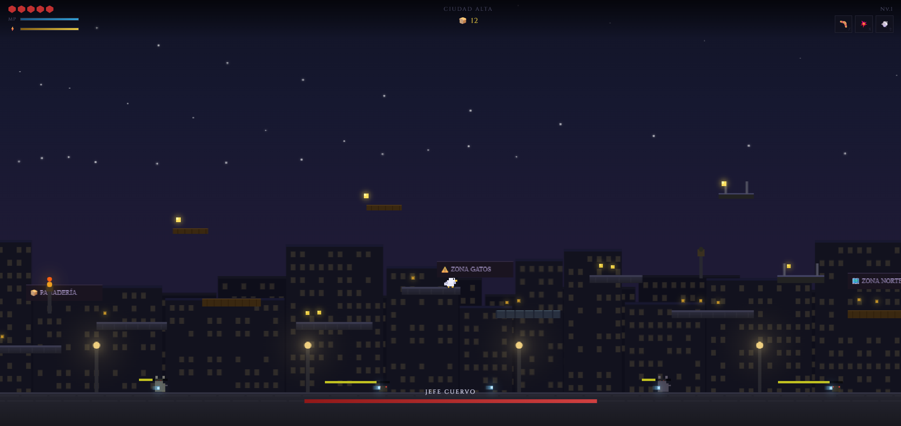

# Paloma Migajera

Un plataformas 2D en el que una paloma explora una ciudad nocturna a la caza de la migaja perfecta. Se juega desde el navegador, sin instalar nada y sin paso de compilación: solo HTML, CSS y JavaScript.

Se juega online en **https://paloma-migajera.vercel.app/**



## De qué va

Por las cornisas de Ciudad Alta no se pasea cualquiera. Tu paloma salta, se desliza por las paredes y lanza su propio PALOMADUKEN mientras esquiva gatos, ratas y cuervos. Las migajas funcionan a la vez de moneda, de experiencia y de excusa para rebuscar en cada rincón. Y como buena influencia metroidvania, cada jefe te deja algo nuevo con lo que llegar más lejos.

## Cómo se juega

- **Escritorio:** abre `index.html`. La pantalla principal te lleva a `menu/`.
- **Móvil:** todo es táctil. Aparecen un joystick y botones de acción en cuanto el dispositivo los detecta, y el HUD se adapta a pantallas pequeñas (muescas incluidas).

Controles por defecto (se pueden reasignar en *Ajustes → Controles*):

| Acción            | Tecla       |
| ----------------- | ----------- |
| Moverse           | ← / →       |
| Saltar (y 2º salto) | Espacio   |
| Atacar            | Z           |
| PALOMADUKEN       | X           |
| Dash              | Shift Izq.  |
| Bajar / picado    | ↓           |
| Mapa              | M           |
| Pausa             | ESC         |

Consejo rápido: saltando contra una pared y saltando de nuevo pegado a ella haces *wall jump*; y guarda el dash para atravesar ataques, porque durante el dash eres invencible.

## La ciudad

Seis zonas encadenadas, más una séptima que el mapa del mundo se toma la molestia de enseñarte aunque sepas que no debes ir todavía.

1. **Ciudad Alta** — el tejado del mundo. Con su cuervo de la chimenea. → **Doble Salto**
2. **Alcantarillas de Migas** — profundidades envenenadas. Con la Rata Reina. → **Dash**
3. **Parque de las Palomas** — el parque junto a la luna.
4. **Torre del Reloj** — donde el tiempo se detiene.
5. **Bosque Encantado** — donde los árboles susurran.
6. **Tejado de los Gansos** — el reino de los gansos y las migajas más gordas.
7. **Nido del Halcón** — bloqueado. Necesitarás todo el repertorio.

Los checkpoints guardan tu posición, vida y migajas. El juego además auto-guarda cada ~5 minutos si lo dejas activado en los ajustes.

## Progresión, que no todo son migas

- **Energía** para las habilidades especiales (el PALOMADUKEN cuesta algo más que un aleteo).
- **Inventario** con consumibles, llaves, tesoros e ingredientes.
- **Plumas de poder** — amuletos equipables (hasta 3) que cambian la forma de jugar: imanes de migas, vidas extra, velocidad.
- **Cuatro dificultades**, de Fácil a Pesadilla, que ajustan el daño recibido y las migajas.
- **Logros** para los que quieran dejarlo todo recogido.
- Y NPC con los que cruzar unas palabras (y de paso soltar alguna migaja).

## Cómo está hecho

Sin frameworks, sin npm, sin compilar nada. Todo corre directo en el navegador:

- **Canvas 2D** como motor de juego (`juego/`): física, render, audio, entidades y zonas.
- **Sprites SVG generados por código** (`shared/svg-system.js`): la paloma y sus estados se dibujan en caliente; algunos efectos usan GIFs (`Doble Salto.gif`, `haduken.gif`, `gato.gif`).
- **Web Audio API** para música y efectos (osciladores y ruido sintetizado, sin archivos de audio), con paisajes sonoros ambientales por zona.
- **Mapa del mundo interactivo** y progreso guardado en `localStorage` (claves `pm_v3_save` y `pm_v3_cfg`).

Estructura del proyecto:

```
index.html              → redirige a menu/
menu/                   → menú principal, nueva partida, dificultad
juego/                  → el juego: física, render, audio, entidades, zonas
shared/                 → utilidades, iconos, sprite system + global.css
mapa/  ajustes/         → pantallas auxiliares
habilidades/  inventario/
Logros/                 → sistema de logros
assets/                 → imágenes, GIFs y capturas
```

## Probarlo en local

Clona el repositorio y abre `index.html`, o sirve la carpeta con cualquier servidor estático:

```
python -m http.server 8000
```

Funciona en navegadores modernos de escritorio y móvil.

## Créditos

Diseño y programación: **Guillermo · Francisco · Daila**.
Inspirado en *Hollow Knight*, pero con más pan.

La licencia está en el archivo [LICENSE](LICENSE).